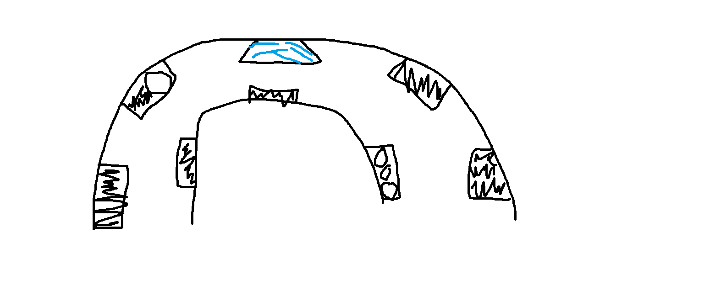

## Les racines qui retiennent le sol

### Lieu: Biosphère 

## À consulter ici: https://calendrier.espacepourlavie.ca/renversant-un-voyage-au-fil-de-leau

## Date : 22 Février 2026

## Nom de l'artiste: Espace pour la vie

## Description: Les racines des arbres et des plantes sont de véritables héros pour le sol. Elles forment un réseau souterrain qui retient la terre et l'aide à absorber l'eau, comme une éponge. Ceci limite l'érosion causée par les pluies. En s'infiltrant, l'eau se charge de carbone, phosphore et d'azote. Quand elle ressort dans les ruisseaux ou les sources, elle apporte ces nutriments essentiels à la vie aquatique.

##### Cette photo a été prise par moi

## Composants: Dans la salle, il y avait une représentation d'une racine.

##### Cette photo a été prise par moi

## Type d'installation: Comtemplative

## Expérience vécu: J'ai bien aimée l'ambiance de la salle. Il y avait des speakers qui faisait des sons comme si ont étaient à l'extérieur dans la nature. Il y avait aussi plusieurs projecteurs sur des murs qui montraient des animaux et des rivières.

##### Cette photo a été prise par moi

## Ce qui m'a plus: Ce qui m'a plus étaient les installations interactives qui permettent de mieux comprendre comment l'eau passe entre les montages, rivières les lacs et plus. Ceci m'a fait réfléchir à l'importance de protéger l'eau et de faire attention a nos gestes.

##### Cette photo a été prise par moi

##### Ce croquis a été faite par moi
