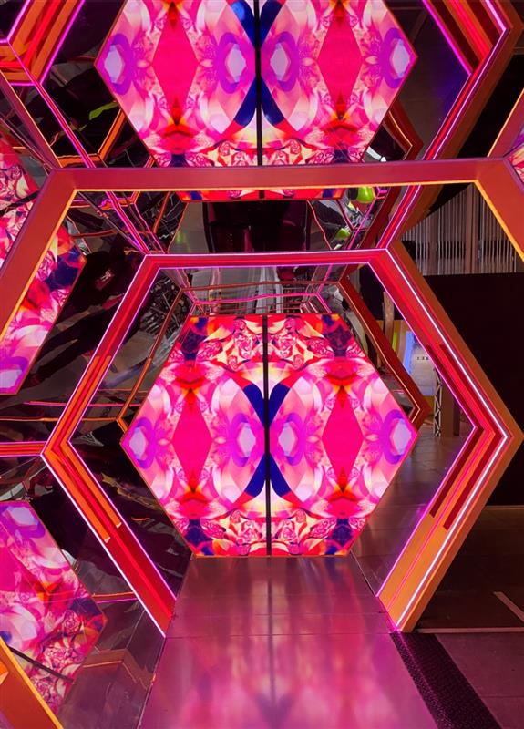
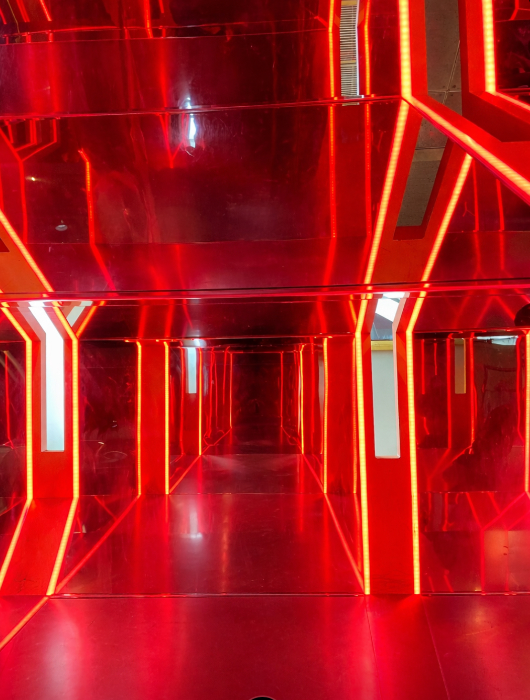
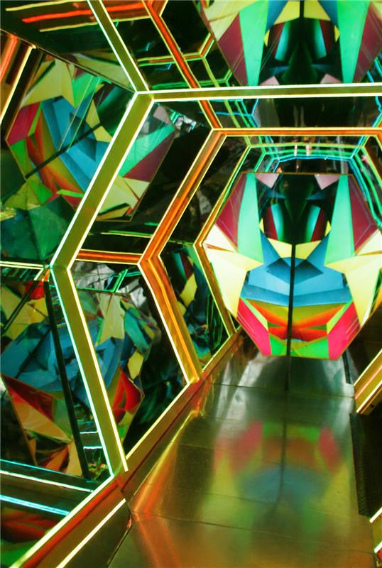
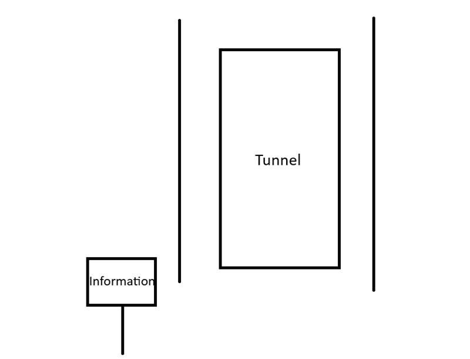
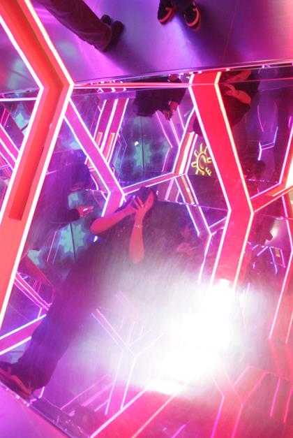

# Le Kaléoscope

### Lieu:
Centre des Sciences

## Date: 
1re Avril 2026

## Nom de l'artiste: 
Création collective du Centre des sciences de Montréal.

## Description:
 Cette œuvre immersive ressemble à un grand kaléoscope interactif fait de miroirs, de lumières LED et de formes hexagonales. Le but de cette création est de mélanger l’art, la science et la technologie pour impressionner les visiteurs et leur faire vivre une expérience unique.

>[Photo de l'entrée de l'oeuvre du Kaléoscope au Centres des sciences de Montréal prise par Amélie Pelletier

## Comment l'oeuvre fonctionne
- Il y a des des miroirs placés autour d’une forme hexagonale.
- Des lumières LED sont installées sur les côtés.
- Les lumières dans le tunnel changent de couleur.
- Les lumières créent des formes et des effets visuels différents.

## Type d'installation:
- L'installation est artistique et immersive
- L' installation est interactive et lumineuse
- l'Installation est basée sur les illusions optique

>[Photo de l'entrée de l'oeuvre du Kaléoscope au Centres des sciences de Montréal prise par Amélie Pelletier

## Expérience vécu: 
L’expérience m’a fait ressentir quelque chose de très positif. Cela m’a donné de la curiosité et de la surprise tout au long du moment. J’ai vraiment aimé cette expérience car elle m’a permis de vivre quelque chose de différent. C’était un moment agréable, calme et très intéressant.  

## Diagramme de l'oeuvre

>Diagramme de l'oeuvre du Kaléoscope au Centre des sciences de Montréal faite par Amélie Pelletier

>[Photo de l'entrée de l'oeuvre du Kaléoscope au Centres des sciences de Montréal prise par Amélie Pelletier

## Référence
https://www.lapresse.ca/societe/famille/2023-02-21/relache/centre-des-sciences-de-montreal-les-dessous-des-expositions-en-cinq-points.php
https://www.centredessciencesdemontreal.com/
